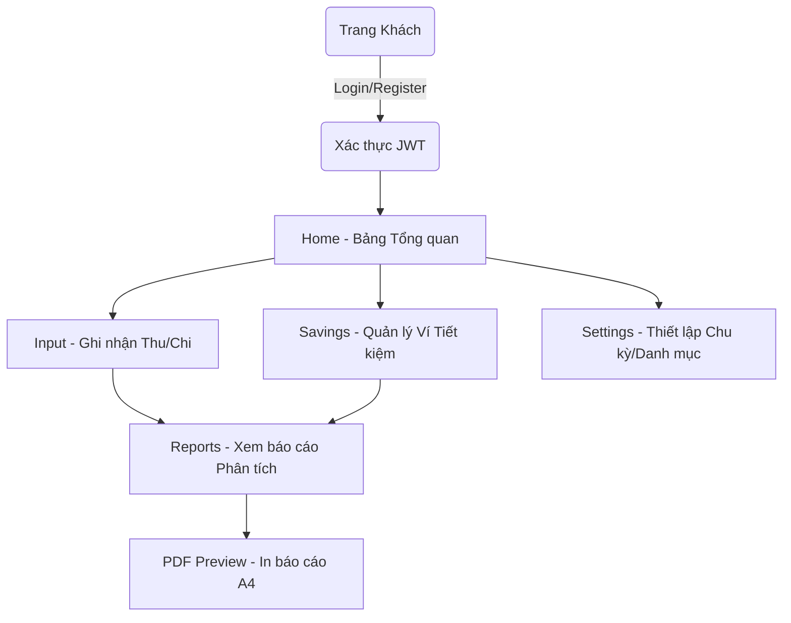

# 💸 Money4Week - Quản lý Tài chính Theo Chu kỳ

<div align="center">


**Giải pháp quản lý tài chính cá nhân thông minh, tập trung vào chu kỳ 4 tuần (28 ngày), giúp bạn kiểm soát dòng tiền, thiết lập mục tiêu tiết kiệm và không bao giờ trễ hạn thanh toán.**

[Demo Dự án](#3-demo) • [Tính năng](#8-chức-năng) • [Cài đặt](#14-cài-đặt) • [API Docs](#10-api)

</div>

---

## 📑 Mục lục
1. [Banner & Thông tin chung](#1-banner)
2. [Giới thiệu](#2-giới-thiệu)
3. [Demo](#3-demo)
4. [Công nghệ sử dụng](#4-công-nghệ-sử-dụng)
5. [Cấu trúc thư mục](#5-cấu-trúc-thư-mục)
6. [Danh sách toàn bộ Page](#6-danh-sách-toàn-bộ-page)
7. [Luồng hoạt động](#7-luồng-hoạt-động)
8. [Chức năng](#8-chức-năng)
9. [Component](#9-component)
10. [API](#10-api)
11. [State Management](#11-state-management)
12. [Routing](#12-routing)
13. [Environment](#13-environment)
14. [Cài đặt](#14-cài-đặt)
15. [Build](#15-build)
16. [Deploy](#16-deploy)
17. [Responsive](#17-responsive)
18. [Cấu trúc dữ liệu](#18-cấu-trúc-dữ-liệu)
19. [Quy ước đặt tên](#19-quy-ước-đặt-tên)
20. [Coding Convention](#20-coding-convention)
21. [Roadmap](#21-tính-năng-sẽ-phát-triển)
22. [Screenshot](#22-screenshot)
23. [FAQ](#23-faq)
24. [License](#24-license)

---

## 1. Banner

* **Tên dự án:** Money4Week
* **Phiên bản:** 1.0.0
* **License:** MIT
* **Last Update:** Tháng 07/2026
* **Framework Frontend:** ReactJS + Vite
* **Build Status:** [](#)

---

## 2. Giới thiệu

**Money4Week** là ứng dụng web quản lý tài chính cá nhân được thiết kế đặc biệt xoay quanh **Chu kỳ 4 tuần (28 ngày)** (hỗ trợ mở rộng 30 ngày hoặc theo tháng dương lịch). 

* **Dành cho ai:** Sinh viên, người đi làm, freelancers, những người muốn quản lý dòng tiền gắt gao, bám sát các khoản tiết kiệm và thanh toán định kỳ.
* **Mục tiêu:** Thay đổi tư duy quản lý tài chính truyền thống, chia nhỏ dòng tiền thành các "khối" tuần để dễ dàng kiểm soát sức khỏe tài chính. Tránh tình trạng "viêm màng túi" cuối tháng.
* **Chức năng lõi:** Theo dõi Thu/Chi, Quản lý Quỹ/Ví tiết kiệm (nhồi mục tiêu), Cảnh báo tới hạn (Smart Alerts) và Xuất báo cáo PDF chuyên nghiệp.

---

## 3. Demo

* 🌐 **Live Demo:** [https://money4-week-fullstack.vercel.app/](https://money4-week-fullstack.vercel.app/)
* 🎥 **Video Hướng dẫn:** *Coming Soon*

---

## 4. Công nghệ sử dụng

| Tên | Version (Ước tính) | Vai trò |
| :--- | :--- | :--- |
| **React** | 18.x | UI Library core để xây dựng các component tương tác. |
| **Vite** | 5.x | Build tool cực nhanh, quản lý môi trường dev. |
| **Tailwind CSS** | 3.x | Utility-first CSS framework để styling giao diện chuẩn Responsive. |
| **React Router DOM** | 6.x | Quản lý Routing, điều hướng (`useNavigate`) giữa các Page. |
| **Axios** | ^1.x | HTTP Client gửi request kèm JWT Interceptors đến Backend. |
| **Lucide React** | ^0.x | Bộ thư viện icon SVG đa dạng, nhẹ cho UI. |
| **React Number Format** | ^5.x | Component tiện ích xử lý định dạng tiền tệ VNĐ realtime. |

---

## 5. Cấu trúc thư mục

```text
src/
 ├── api/                 # Tầng cấu hình giao tiếp với Backend
 │   ├── analyticsApi.js  # Thống kê, ghi chú (notes)
 │   ├── authApi.js       # Xác thực (Login, Register, Reset Pass)
 │   ├── axiosClient.js   # Instance Axios cấu hình interceptors, token header
 │   ├── categoryApi.js   # API Danh mục cơ bản
 │   ├── remindersApi.js  # Lấy/tạo mục tiêu kế hoạch
 │   ├── reportsApi.js    # Data xuất báo cáo biểu đồ
 │   ├── transactionsApi.js # CRUD Thu/Chi và Danh mục chuyên sâu
 │   └── walletsApi.js    # Quản lý ví tiết kiệm, Nạp/Rút
 ├── components/          # Thư mục dành cho các UI Component tái sử dụng
 ├── pages/               # Tầng giao diện chính (Views)
 │   ├── Auth.jsx         # Xác thực người dùng (Đăng nhập/Đăng ký)
 │   ├── Home.jsx         # Dashboard tổng quan tài chính
 │   ├── Input.jsx        # Ghi chép Thu/Chi, kế hoạch để dành
 │   ├── PDFPreview.jsx   # Bản xem trước A4 hỗ trợ xuất PDF
 │   ├── Reports.jsx      # Báo cáo dạng biểu đồ phân tích
 │   ├── Savings.jsx      # Quản lý các ví tiết kiệm
 │   └── Settings.jsx     # Thiết lập hồ sơ, chu kỳ, danh mục
 ├── App.jsx              # Setup Layout & Routes
 ├── main.jsx             # Entry point của React + Vite
 └── index.css            # Tailwind directives & Custom CSS
```

---

## 6. Danh sách toàn bộ Page

| Tên page | Đường dẫn (Dự kiến) | Mục đích | Component chính (Khối UI) | API sử dụng | Trạng thái |
| :--- | :--- | :--- | :--- | :--- | :--- |
| **Auth** | `/login`, `/register` | Cổng xác thực người dùng. | Form đăng nhập/Đăng ký, Hiện/Ẩn Pass | `authApi` | Hoàn thành |
| **Home** | `/` | Dashboard điều khiển tổng quan. | Thống kê số dư, Biểu đồ bar thu/chi, Lịch, Todo notes | `analyticsApi`, `remindersApi`, `usersApi`, `reportsApi` | Hoàn thành |
| **Input** | `/transactions` | Thêm, sửa, xóa các khoản thu/chi. Xem chi tiết theo danh mục, quản lý mục tiêu. | Giao diện thu/chi, Custom Dropdown, Lịch sử, Bảng kế hoạch | `transactionsApi`, `remindersApi` | Hoàn thành |
| **Savings** | `/savings` | Quản lý các ví tiết kiệm. | Card ví tiết kiệm, Modal nạp/rút tiền, Bảng lịch sử phân bổ | `walletsApi`, `transactionsApi` | Hoàn thành |
| **Reports** | `/reports` | Xem phân tích báo cáo biểu đồ trực quan. | Filter (Thời gian/Danh mục), Donut Chart, Bar Chart, Bảng số liệu | `reportsApi`, `transactionsApi`, `usersApi`, `walletsApi`, `remindersApi`, `categoryApi` | Hoàn thành |
| **PDFPreview** | `/reports/preview` | Template render A4 chuyên dụng in ấn báo cáo. | Toolbar Print, Khung A4, Biểu đồ tĩnh | `reportsApi`, `usersApi`, `walletsApi`, `remindersApi`, `categoryApi` | Hoàn thành |
| **Settings** | `/settings` | Tùy chỉnh ứng dụng theo cá nhân hóa. | Cấu hình Avatar/Tên, Chỉnh loại Chu kỳ, Quản lý CRUD Danh mục | `usersApi`, `transactionsApi` | Hoàn thành |

---

## 7. Luồng hoạt động



Luồng Token: Khi Token hết hạn, `axiosClient` interceptor bắt lỗi `401 Unauthorized`, tự động xóa `localStorage` và đẩy người dùng ngược về trang Đăng nhập.

---

## 8. Chức năng

### Authentication
* **Đăng nhập/Đăng ký:** Xác thực tài khoản với backend, lưu token vào local.
* **Quên mật khẩu:** Cấp lại mật khẩu trực tiếp (`resetPasswordDirect`).

### Dashboard (Home)
* **Smart Alert:** Tự động cảnh báo (số tiền, số ngày) khi có khoản thanh toán tới hạn.
* **Lịch mini:** Hiển thị và bôi đỏ các ngày có hạn chót (due date) của mục tiêu.
* **Todo Notes:** Tạo các ghi chú nhanh có đánh dấu hoàn thành.

### Ghi chép Thu / Chi (Input)
* **Nhập liệu động:** Hỗ trợ format số VNĐ ngay khi gõ (`NumericFormat`).
* **Thống kê:** Tính toán tỷ lệ % chi tiêu theo danh mục so với tổng chi, đối chiếu hạn mức (Limit).
* **Kế hoạch để dành:** Tự chia nhỏ số tiền cần tiết kiệm mục tiêu thành mức cần đóng mỗi tuần.

### Quản lý Ví (Savings)
* **Tạo ví:** Tạo ví với các icon, màu sắc chuyên biệt.
* **Nạp / Rút:** Nạp tiền vào ví tự động tạo 1 khoản "Chi" (expense) và ngược lại rút tiền tạo khoản "Thu" (income) trong hệ thống để tự động trừ số dư thực.

### Báo cáo & Xuất file (Reports / PDFPreview)
* **Lọc đa tầng:** Lọc giao dịch theo từng tuần hoặc lọc theo danh mục cụ thể.
* **Biểu đồ SVG:** Vẽ biểu đồ Donut trực tiếp bằng thuộc tính SVG `stroke-dasharray` (Không dùng thư viện nặng).
* **Tối ưu Print PDF:** Định dạng trang in bằng CSS (`@page { size: A4 portrait }`, `print-color-adjust: exact`) giúp bản in không bị mất background color của trình duyệt.

### Thiết lập Hệ thống (Settings)
* **Roll-over Chu kỳ:** Hỗ trợ 3 chuẩn chu kỳ: 4 tuần, 30 ngày, 1 tháng dương lịch.
* **Quản lý danh mục:** Thêm, sửa, xóa, tùy biến icon (từ Lucide) và gắn màu mã HEX tùy thích.

---

## 9. Component

Dự án hiện đang cấu trúc các module UI phức tạp bên trong Page. Đề xuất Refactor các Component UI Tái sử dụng sau:

* **`DonutChart`:** Biểu đồ tròn trực quan phân tích cơ cấu chi tiêu bằng SVG, tự động hiển thị tooltip.
* **`BarChart`:** Biểu đồ cột thể hiện thu chi theo các tuần.
* **`ChangeBadge`:** Component nhỏ hiển thị % thay đổi tăng/giảm so với kỳ trước bằng mũi tên xanh/đỏ.
* **`CustomDropdown`:** Hệ thống Dropdown tự tạo hỗ trợ icon, color và chống đóng menu ngoài ý muốn.

---

## 10. API

Hệ thống giao tiếp thông qua Axios Instance với các endpoints sau:

| Method | Endpoint | Mục đích | Module (Frontend) |
| :--- | :--- | :--- | :--- |
| `POST` | `/api/auth/login` | Cấp phát token đăng nhập | `authApi.js` |
| `POST` | `/api/auth/register` | Đăng ký user | `authApi.js` |
| `POST` | `/api/auth/reset-password-direct` | Đổi mật khẩu trực tiếp | `authApi.js` |
| `GET` | `/api/analytics/dashboard` | Thống kê overview trang chủ | `analyticsApi.js` |
| `POST/PUT/DEL`| `/api/analytics/notes` | CRUD ghi chú (Todo) | `analyticsApi.js` |
| `GET/POST/PUT`| `/api/transactions` | Lọc danh sách, tạo Thu/Chi | `transactionsApi.js` |
| `GET/POST/PUT`| `/api/categories` | Lấy/Quản lý danh mục | `categoryApi.js`, `transactionsApi.js` |
| `GET/POST/PUT`| `/api/wallets` | Quản lý Ví tiết kiệm | `walletsApi.js` |
| `POST` | `/api/wallets/:id/deposit` | Nạp tiền ví | `walletsApi.js` |
| `POST` | `/api/wallets/:id/withdraw` | Rút tiền ví | `walletsApi.js` |
| `GET` | `/api/wallets/history` | Xem lịch sử phân bổ ví | `walletsApi.js` |
| `GET/POST/DEL`| `/api/reminders` | Quản lý Mục tiêu Kế hoạch | `remindersApi.js` |

---

## 11. State Management

Dự án duy trì sự gọn nhẹ, **không sử dụng** Redux, Zustand hay Context.
* **Local State (`useState`):** Xử lý input form, trạng thái popup/modal, biến loading nội bộ.
* **Derived State (`useMemo`):** Phân tích dữ liệu lớn từ backend thành Chart Data, Table Data nhằm tối ưu hiệu năng render.
* **Persisted Storage (`localStorage`):** Lưu trữ toàn cục các biến quan trọng: `accessToken`, `refreshToken`, `userName`, `userEmail`, `userAvatar`, `userCycleType`, `userCycleAnchor`, `lastProcessedCycle`.

---

## 12. Routing

*Danh sách điều hướng toàn hệ thống:*
* `/login`, `/register` - Trang xác thực
* `/` - Dashboard / Home
* `/transactions` - Ghi chép (Input)
* `/savings` - Quản lý Ví tiết kiệm
* `/reports` - Biểu đồ Báo cáo
* `/reports/preview` - Trình xuất PDF
* `/settings` - Thiết lập hệ thống

---

## 13. Environment

Bản build của Vite yêu cầu cấu hình biến môi trường trong file `.env`:

```env
# Endpoint gốc kết nối đến server Backend
VITE_API_URL=http://localhost:5000/api
```

---

## 14. Cài đặt

Yêu cầu máy phải có **Node.js (phiên bản >16.x)**.

1. Clone kho lưu trữ về máy:
```bash
git clone https://github.com/ThThuy287/Money4Week-Fullstack
cd money4week
```

2. Tải và cài đặt các Packages/Dependencies:
```bash
npm install
# hoặc
yarn install
```

3. Khởi động môi trường Dev:
```bash
npm run dev
# Mở trình duyệt ở http://localhost:5173
```

---

## 15. Build

Khởi tạo cấu trúc tĩnh (Static assets) sẵn sàng để đưa lên Production:

```bash
npm run build
```
Thư mục `dist/` sẽ được tạo ra chứa các file đã minify và optimize.

---

## 16. Deploy

Dự án tương thích hoàn toàn với nền tảng **Vercel**.

1. Commit code đầy đủ lên nhánh `main` (hoặc `master`).
2. Truy cập Vercel, chọn **Add New Project**.
3. Import từ kho lưu trữ GitHub của bạn.
4. Ở phần Environment Variables, khai báo `VITE_API_URL` bằng đường dẫn backend production.
5. Bấm **Deploy**.

---

## 17. Responsive

Giao diện được thiết kế **Mobile-First** bằng TailwindCSS:
* **Mobile (< 640px):** Layout đơn cột. Các bảng dữ liệu (Table) được chuyển đổi linh hoạt thành dạng danh sách thẻ (Card List) để tránh tràn ngang. Thanh bộ lọc cuộn vuốt thay vì xếp hàng.
* **Tablet (640px - 1024px):** Layout 2 cột cho các thẻ số liệu và Form nhập liệu, tối ưu không gian màn hình trung bình.
* **Desktop (> 1024px):** Bố cục Side-by-side, Sidebar dọc (ở Settings), hiển thị Data Tables đầy đủ chi tiết với hiệu ứng di chuột (Hover effects) chuyên nghiệp.

---

## 18. Cấu trúc dữ liệu

Các payload cốt lõi phía Frontend giao tiếp với Backend:

* **Authentication:** `{ email, password, full_name? }`
* **Transaction:** `{ category_id: int, type: 'income' | 'expense', amount: int, date: string, note: string }`
* **Category:** `{ name, note, color_hex, icon, type, limit_amount }`
* **Wallet / Reminder:** `{ name/title, amount/target_amount, deadline/due_date, category_id, icon, color_hex, autoFrequency }`

---

## 19. Quy ước đặt tên

Dự án tuân theo chuẩn quy ước:
* **Components / Pages:** `PascalCase` (vd: `PDFPreview.jsx`, `DonutChart`)
* **Functions / Hooks:** `camelCase` (vd: `handleSaveTransaction`, `useMemo`)
* **Thư mục (Folders) / Tên class CSS:** `kebab-case`
* **File API Modules:** Kết thúc bằng hậu tố `Api` (vd: `walletsApi.js`)

---

## 20. Coding Convention

* Component React được xây dựng hoàn toàn bằng **Functional Component** & Hooks.
* Icon hiển thị được tách thành Component con `getIconComponent()` map string ID với component thực của thư viện `Lucide React` để dễ parse qua Database.
* Tự động vô hiệu hóa cơ chế cache cứng bằng tham số query URL `_t: Date.now()` khi Fetch API lấy dữ liệu mới nhất.
* Inline styles đa số dùng `Tailwind` classes. CSS nội tuyến `style={{}}` chỉ dùng cho các biến động như chiều cao biểu đồ `%` hoặc mã màu HEX tự tạo.

---

## 21. Tính năng sẽ phát triển

- [ ] **Dark Mode:** Bổ sung giao diện Nền đen (Theme Toggling).
- [ ] **Refactoring Component:** Đóng gói Component `DonutChart`, `BarChart`, `CustomDropdown` thành thư mục UI riêng.
- [ ] **Excel Export:** Khả năng tải xuống dữ liệu thô dạng bảng tính CSV/XLSX.
- [ ] **Skeleton Loading:** Thay thế vòng tròn Loading Spinner hiện tại bằng hiệu ứng Skeleton chuyên nghiệp.
- [ ] **Đa ngôn ngữ (i18n):** Khả năng chuyển đổi Tiếng Việt/Tiếng Anh.

---

## 22. Screenshot

* [https://money4-week-fullstack.vercel.app/](https://money4-week-fullstack.vercel.app/)
---

## 23. FAQ

**H: Tôi nạp tiền vào ví tiết kiệm, tại sao nó lại được tính là "Chi"?**
Đ: Khi bạn trích lập tiền vào ví tiết kiệm (Ống heo), dòng tiền khả dụng của bạn đã rời khỏi quỹ chi tiêu hàng ngày, hệ thống sẽ tự động hạch toán khoản này vào "Chi". Khi bạn "Rút" từ ví ra để sử dụng, hệ thống tính là "Thu". Logic này giữ cho báo cáo luôn minh bạch.

**H: Làm sao để thay đổi Chu kỳ 4 Tuần thành 1 Tháng?**
Đ: Bạn có thể vào mục Cài đặt (Settings) -> Tùy chỉnh Chu kỳ -> Chọn loại "Theo tháng dương lịch". Hệ thống sẽ lập tức thiết lập lại báo cáo cho đến cuối tháng.

**H: PDF báo cáo của tôi tải về bị mất biểu đồ màu sắc?**
Đ: File `PDFPreview.jsx` đã được nhúng sẵn CSS in chuẩn nền `@media print { print-color-adjust: exact !important; }`. Nếu vẫn không thấy màu, vui lòng bật tùy chọn "Background graphics" (Hình nền) trên hộp thoại in của Chrome/Edge.

---

## 24. License

Distributed under the MIT License.

## 25. Author
* **Thanh Thủy** - *Fullstack Developer*

## 26. Acknowledgement
* [ViteJS](https://vitejs.dev)
* [TailwindCSS](https://tailwindcss.com)
* [Lucide Icons](https://lucide.dev)
* [React Number Format](https://www.npmjs.com/package/react-number-format)

## 27. Contact
* Thạch Thanh Thủy
* Link Repository: [https://github.com/your-username/money4week](https://github.com/your-username/money4week)
